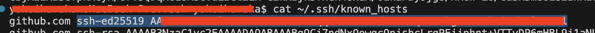

# 概要

dataformを使ったデータパイプライン構築のサンプルプロジェクト
- `sample_data/`にあるデータをベースに色々試す用
  - データはこちらからお借りした https://zenn.dev/dbt_tokyo/books/537de43829f3a0/viewer/tutorial#%E3%83%86%E3%82%B9%E3%83%88%E3%83%86%E3%83%BC%E3%83%96%E3%83%AB%E3%81%AE%E6%BA%96%E5%82%99
- CI/CDを整備し環境別のデプロイなども実現している
- dataformとGitHubとの連携やそのほかセットアップなどは以下の作業メモに記載


環境別にデプロイできている様子↓


# 以下作業記録メモ

## 1. CLIでのdataformプロジェクトの作成履歴

### dockerに入る

```
$docker-compose up -d
$make in
```

### dataformのプロジェクト雛形作成
```
/workdir # dataform init workflow-project iida-test-423114 asia-northeast1
```

### 認証情報の作成

Google Cloudでサービスアカウントを作成する。
dataformではサービスエージェント（Google管理のサービスアカウント）があり、このサービスエージェントとサービスアカウントそれぞれ以下のように権限を設定しておく


サービスアカウントのキーファイルをworkflow-project直下に配置する（`workflow-project/service-account.json`という名前にしておく）


次にdocker内のまま以下のコマンドで認証情報を作成する
```
/workdir # cd workflow-project/
/workdir/workflow-project # dataform init-creds

[1] US (default)
[2] EU
[3] other

Enter the location of your datasets [1, 2, 3]: 3
Enter the location's region name (e.g. 'asia-south1'):
> asia-northeast1

[1] ADC (default)
[2] JSON Key

Do you wish to use Application Default Credentials or JSON Key [1/2]: 2
Please follow the instructions at https://docs.dataform.co/dataform-cli#create-a-credentials-file/
to create and download a private key from the Google Cloud Console in JSON format.
(You can delete this file after credential initialization is complete.)

Enter the path to your Google Cloud private key file:
> service-account.json                             

Running connection test...
(node:73) [DEP0040] DeprecationWarning: The `punycode` module is deprecated. Please use a userland alternative instead.
(Use `node --trace-deprecation ...` to show where the warning was created)

Credentials test query completed successfully.

Credentials file successfully written:
  /workdir/workflow-project/.df-credentials.json
To change connection settings, edit this file directly.
```

`workflow-project/.df-credentials.json`ができていたらOK

### データセットの設定

workflow_settings.yamlのデータセット名を使用するものに変更する
```
defaultDataset: dataform_sample
```

### ワークフローファイルの作成
workflow-project/definitions以下にsourcesディレクトリと、tablesディレクトリを作成して各sqlxファイルを作成する


### ワークフローの実行

```
/workdir/workflow-project # dataform run
Compiling...

(node:113) [DEP0040] DeprecationWarning: The `punycode` module is deprecated. Please use a userland alternative instead.
(Use `node --trace-deprecation ...` to show where the warning was created)
Compiled successfully.

Running...

Table created:  dataform_sample.customers [table]
```
以上で動作することを確認した。これで一応ローカルからでも実行できるようにしておいた。


## 2. Google Cloudのコンソールからdataformのリポジトリを作成して連携する

### dataform上でリポジトリを作成
CLIでdataformは実行できるようになったが、Google Cloudコンソールでdataformを見ても何も表示されていなかった
dataform上でもリポジトリを作って、このリポジトリと連携する必要があるので、dataformのコンソール上でリポジトリを作成


### Git連携（ssh）

手元でdockerから抜けて、macでsshキーを作成
```
ssh-keygen -t ed25519
```

これをGitHubのリポジトリのデプロイキーに設定する。

次にシークレットマネージャーに秘密鍵を登録する。

その後、dataformのコンソールの画面に移り、SETTING > GIT接続 から連携する


⚠️ 「ホストのSSH公開鍵のKey-Value」という項目は、公開鍵の値をそのまま入れるのではダメで、以下のようにknown_hostsから取得が必要なので注意。




```
$cat ~/.ssh/known_hosts
github.com ssh-ed25519 XXXXXXXXXXXXXXXXXXXXXXXXX

→ ssh-ed25519 XXXXXXXXXXXXXXXXXXXXXXXXX をコピーして、「ホストのSSH公開鍵のKey-Value」の項目に貼り付ける
```

またサービスアカウトにIAMのSecret Managerの権限付与が必要なのも注意


### Gitのブランチをdataformのワークスペースを同期する方法

dataformのリポジトリ内にはワークスペースという概念があり、Gitでいうブランチに対応する（各々の作業スペース）
ワークスペースの名前（IDのこと）とブランチの名前を一致させると、同期することができる

以下同期の例（GitHubで先にブランチ作るケース）
1. 手元でブランチ作ってPUSHする
2. dataformで同じ名前のワークスペースを作成する
3. dataform上でPULLボタンがでるのでする。（以下画像参考）


## 3. dataformコンソール上で使えるように設定

### workflow_settings.yamlはプロジェクトルートに必要

workflow_settings.yamlファイルが、wortflow-projectディレクトリ以下に入っていたがこれではdataform上でワークフローの実行ができなかった（認識されなかった）ので
workflow-projectディレクトリは削除して中のファイルを全てルートに移した。（階層を浅くした）

そしてdataform上でworkflow_settings.yamlを開いてパッケージのインストールを行うことで、実行（EXECUTION）できるようになった
（パッケージのインストールは、workflow_settings.yaml か package.json を開くとインストールのボタンが出る）


## 4. 完了

以上でdataformとGitHubが連携できてどちらからでも編集してパイプラインの開発が進められるようになった

## Tips - CIの利用

CI上のインスタンスで、dataformの認証が必要
認証の仕方は.df-credentials.jsonの暗号化したものをコミットに含めて置き、それをCI上で復号して使う

認証ファイルの暗号化は以下で行う（パスフレーズの設定が求められる）

gpgが入ってない場合は入れる
```
brew install gpg
```

```
gpg --symmetric --cipher-algo AES256 .df-credentials.json
```

パスフレーズはGitHubのsecretに登録して用いる

復号は以下のコマンドで可能
```
gpg --quiet --batch --yes --decrypt --passphrase="$CREDENTIALS_GPG_PASSPHRASE" --output .df-credentials.json .df-credentials.json.gpg
```